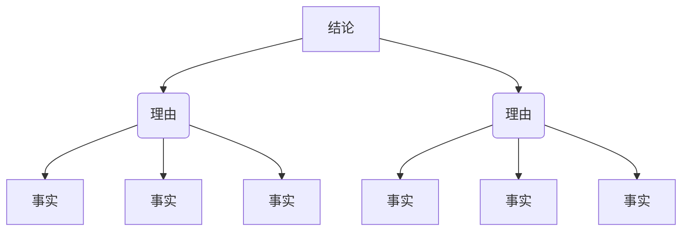

# 1、为什么要学习结构性思维？
## 痛点分析
+ 痛点1：说话不清楚（表达能力？），30mins说不到核心vs**3句话说清楚**；
+ 痛点2：展演做不好（写作能力？），30页PPTvs**5页PPT**；
+ 痛点3：任务完不成（工作能力？），一星期冥思苦想，反复修改vs**一天时间庖丁解牛**


**最根本原因：没有形成快速有效处理信息的思维方式，逻辑结构不清晰。**

## 如何解决
1. **为什么**要逻辑结构：大脑一次性接受信息的量是有限的，偏爱**有规律**的信息。

> eg：举例表现：反应快，不一定更聪明而是懂得通过有效的思维方式，让大脑快速对信息进行归纳和整理，准确地抓住核心，规划行动。
>

2. **作用**：通过结构化思维：有结构、有规律整理，提高思考效率，让复杂的问题变得简单化。
3. **应用**：高效传递信息的能力，分析问题和解决问题的能力，在面临问题，把所有和寻求解决方法无关的信息删除，把问题化繁为简，把握本质。同时能够让你表达观点有理有据、条理清晰地证明这个观点。

## 课程内容安排
1. 什么是结构化思维
2. 面对海量信息如何高质量接受
3. 如何对信息进行归类整理
4. 如何有效总结得出结论
5. 怎样输出表达信息，让你的对外呈现更加完美


# 2、什么是结构化思维？
## what
结构化思维：**面对问题，通过某种结构，拆解为你能解决的部分。**

> 200ml的水和100ml的杯子？
>

装不进的原因，总结有三个

1. 杯子太小
2. 水是液态的，会流动
3. 外部环境因素，地球有重力、


从杯子分析：找像气球一样的杯子，随着水进入，会变大。  
从水流动：水冻成冰柱。  
从外部环境：太空，水变成水球，装得下。


这就是用结构化思维分析问题，拆解为三个方面，然后逐个分析得出结论，想得全，分析得很清楚。

## 金字塔结构图
结构化思维就是从**无序**到**有序**的思考过程：

+ 建立“先总后分”的立体化思维方式，
+ 先看能够解决问题的关键方面；
+ 再往下分析  
实现从总部到局部的鸟瞰，不拘泥细节  
这种思维方式具象成一幅画，就是一张金字塔结构的树状图，上面小，下面大。


从纵向看：  
最顶端就是**需要解决的问题**  
下一层：支撑解决问题的不同方面  
在下一层：支撑这些不同方面的原因（子理由）


从横向看：  
每个层级的子理由也要符合结构化  
通过归类分组将信息排序和穷尽MECE

## 使用结构化思维
+ 应用于思考解决问题：**一旦逻辑推演，按照金字塔图把思维过程画出来**
+ 应用于筛选、识别信息，得出结论：**将金字塔倒过来，像漏斗一样思考**

> 面对海量信息，像漏斗一样思考。
>
> 
>

纵向看：  
最上面就是接受到的各种各样的信息，  
下面一层，经过上面的归纳，提炼。  
最后一层，反复归纳提炼，沉淀下来最底层的结论。


问题：  
如何层层筛选，控制好思考呢?  
方法：  
用结构化思维完成**信息识别，归纳，概括，总结和表达**。

# 3、怎样识别筛选信息
## 接受信息的方式
+ 主动：有明确目标或者待解决的问题。  
特别关注信息和目标之间的关联性（找关键词）
+ 被动：**被动接受海量信息**。（重点）

## 识别的重点
**识别结论、理由、事实。**

> eg: 下级汇报：  
“领导，目前集团旗下的电脑市场，市场占有率逐年提升，但收益却逐年降低。主要是因为国内市场的竞争太激烈，我们不得不进行低价竞争。所以，利润率逐年递减也是没办法的事情。”
>


容易被看似复杂的表面信息迷惑--没有对信息有效识别。  
how？？？

+ 用结构化思维的方法，接收信息的时候，识别成结论、理由和事实这三个部分。

```c
if (三个部分要素不完备 or 三者之间逻辑不完备）{
     print（“信息存疑”）
}
```

## 如何识别结论，理由和事实
### 结论
+ 为什么要结论：作为信息的接收者，最关心的就是，明确对方想表达的结论。
+ **什么是结论？**：中心思想，**一定是个观点**，即从一定的立场或角度出发，对事物和问题的看法。

> 结论：公司电脑产品利润率逐年递减也是没办法的事情。这就是这个部门主管的一个观点。
>

+ 怎么找到结论？
1. 找到对方话里表示结论的提示词。（因此、断定、所以，问题的实质是、证明了）等等
2. 关注信息的几个重要位置（开头、结尾）
3. 面对面交谈的话，可以问所以呢。

> 看完一篇文章，逼迫自己问所以呢？
>

### 理由
+ 为什么要理由：判断结论是否有价值，是否有理由支撑。

> 国内市场的竞争太激烈，我们不得不进行低价竞争。即他认为xxx的这个结论的理由。
>

+ 如何找出理由：
1. 关注提示词（原因是，鉴于，证据是，第一，第二，有下列原因）
2. 结论的前后。

### 事实
+ 什么是事实：结论和理由都可以是主观的，但事实一定客观。
+ 什么是客观：数据和不带感情色彩的事例，即通过金字塔结构拆解到最后，支撑结论和理由的东西。
+ 事实可靠性：只有事实可靠并且用它来支撑前面的理由和结论的逻辑是顺畅的，那接受的整个信息才是完整可信。

因此：事实-理由-结论，找出信息链并加以分析。

### 如何判断信息的真实性与可靠性
关键有两个要点：

+ 要有客观事实支撑结论和理由。
+ 事实和理由，理由和结论之间要有证明和被证明的逻辑关系。

> eg: 汇报的下级并未给出任何支撑的事实，这是一个不健全的信息链，结论不一定可靠。
>

如何证明信息不可靠（批判性思维、学会提问）

+ 逻辑结构证明：找出理由中隐含的假设，判断假设是否合理，分析证明是否合理。
+ 底层信息证明：找到一些具体的数据和事例，能推导出对方想论证之外的理由。

## 结构化思维总结


金字塔结构，帮助解释什么是结构化思维以及识别信息。  
识别信息纵向看：  
信息的结论：金字塔的塔尖。  
下一层：根据线索找到支撑结论的理由；  
理由往下：找支撑理由的事实。  
并判断这个链路是否严谨健壮。  
根据这三个因素，对着金字塔结构梳理出信息的逻辑线，判断信息的完整性和可靠性。


# 4、怎样归纳整理信息
纵向用来筛选：寻找结论、理由和事实  
横向用来分类：对信息归纳整理

### 1、为什么要对信息分类
**一个分类里相近的事物更容易记住。**

> 人的大脑一次性接受信息的量是有限的，大脑有自动将某些具有特点的事物进行归类和重组的能力。
>

eg：销售总结的拉近客户距离九条心法  
当分类为  
(1)无时无刻需要做的；  
(2)根据顾客的不同反应分别去应对的。

### 2、分类的法则和方法
**法则**：MECE法则 (Mutually Exclusive,Collectively Exhausitve) 相互独立、完全穷尽。


eg：男人和女人  vs 男人和未婚女人  
判断信息要素是不是分类清楚了，用MECE法则先穷尽再分析


注意点：遇到其他，想一想是否可以列入上面某一类，如果不需要其他这一栏。


**方法**：

+  **过程法**  
按照事情发展的时间、流程和程序，对信息分类。  
eg：日程表、解决问题的几个步骤、达成目标的3个阶段，都属于过程分类，特别适用于在对项目进展和阶段的汇报上。 

> 销售的九条心法：顾客进店、店内接待和送客
>

+  **二分法**  
分为A和非A。eg：国内、国外；他人、自己；左右、收支 
+  **矩阵法**  
eg：安排工作四象限，2次二分法；给员工布置任务，考虑两个因素：有时间和有意愿。


+  **公式法**  
公式成立，比如销售额=单价X数量，把销售额通过公式拆解了单价和数量。eg：很多外资面试计算中国多少车辆，北京多少餐馆。考察信息的归纳、整理能力，看你能不能用一个公式的方法把信息进行不重不漏的整理，也就是一个人结构化思考的能力。 
+  **要素法**  
把一个整体分成不同的构成，可以由上到下、从外到内、从整体到局部。eg：公司的组织架构图、优秀员工的7中品质等。  
用法：不仅仅对全部信息进行归纳整理，在于用MECE对事物的构成要素进行思考可以激发你没有想到的点子、扩宽你的思路。 

### 3.特定场景的分类模型
+ 大部分MECE较为通用，特定场景有现成答案。 

**市场战略3C**：  Company、Customer、Competition  
公司、顾客、竞争对手。  
防止公司忽略用户需求、市场行情，自顾自去开发产品，导致血本无归的情形。  
**市场营销4P**： Product、Price、Place、Promotion  
产品、价格、渠道和营销  
避免低价格一定有好营销的误区。


类似模型有很多，可以有心积累作为思考工具，根据工作需要，选择不同的工具。

# 5、怎样提炼信息结论
纵向拆分：识别信息中核心要素  
横向分类：对信息归纳整理


eg：年终述职，“有思想”和“没思想”的差别：结论的提炼。

> 述职原版：（踏实完成任务）vs（有思想）  
1.上一年的培训工作总结  
2.下一年的培训工作计划
>


问题： 没有把工作的核心总结出来，概括不够彻底。  
思考：结论是有中心思想的主题句。  
改变：**去年打造有生命力的营销培训项目**，有核心思想的结论，并且受众知道他去年到底做了什么。


**思考：如何根据已有的信息素材提炼结论？**

### 归纳法
从特殊到一般。识别信息、整理信息的基础上，找出各个信息要素之间的共性。

> eg：喜鹊是鸟，喜鹊会飞，乌鸦是鸟，乌鸦会飞。所以结论是凡事鸟都会飞。
>

归纳法：日常常见，但是要保证罗列的要点穷尽，否则不一定正确。例如：鸵鸟不会飞。如何穷尽MECE法则。

找共性：  
1.描述性概括（找出**事物属性**上的共同点）

> 用述职报告说明:  
三类工作的共性是什么？培训。  
再进一步，全年核心工作都是营销培训。
>

2.行动性概括（找出**事件结果**的共性）

> 三类工作的共同结果：提升了学员对营销的热情和参与度。
>

这两种提炼的差别：  
①事物属性的共同点  
②往前更进一步，导向最终的结果。


**往往一个好的结论，是两种共性方法的结合。  
首先找到事情本身的共性，再根据其发展演变的导向，总结导向的结论。**


述职报告的共性  
1.工作本身的共性：培训。  
2.工作结果的共性：提升了学员对营销的热情和参与度。  
结合：打造有生命力的培训项目。


**结构化思维的核心-->金字塔结构图**



归纳法：由金字塔底部开始，把所有要素进行归类，由下向上推演。在推演到金字塔顶的总结论之前，要素间还存在很多自结论。


可能的情况：

+ 只是罗列了细节，没有概括总结。
+ 没有推演到金字塔顶，错误将子结论认为真结论，概括的不彻底。

办法：  
**多问一句：所以呢？不断追问所以呢？**  
做结论推演时，把金字塔结构图画出来，每向上推演一层，都问一句自己所以呢，知道这个结论问不出所以是什么。

### 演绎法
演绎推理，亚里士多德的三段论演绎法。  
**大前提，小前提和结论**


大前提：事物的共性；  
小前提：具体事物；  
结论：具体事物的性质。


> eg： 苏格拉底会死  
大前提，所有人都会死；  
小前提，苏格拉底是人；  
结论：苏格拉底一定也会死。
>


由一般到特殊，将某一个事实与对应的规律联系起来，得出结论。  
应用：说服别人，用演绎法。  
原因：大前提是一个具有普遍意义的常识，所以推出的结果会让人感到特别可信，对拒绝心理的听众特别有效。


> eg: 跟领导申请加薪或升职  
大前提：罗列出公司最高级岗位的一些要求；  
小前提：依据大前提的几个方面，列举自己符合了这个要求  
结论：我满足高级要求，可以胜任高级岗位。
>


注意：


+  **大前提一定要满足无可争议的条件，否则说服无法达到效果。**  
挑选公司内部，大家都认可的规则，eg：能够一个人完整地负责项目，完美地交付。或者一般常识：勤奋、有责任心、自我驱动高等。 
+  **小前提不能马虎，为了让结论更有说服力，最好是一个已经发生的事实。**  
eg：我曾经独立负责过什么样的项目，这个项目获得了哪些收益和成果。 

当大小前提都符合无可争议的条件后，说服一定可以完成。


问题：什么是容易引起争议的前提？

+ 大前提是主观判断  
eg： 你认为的大前提不是对方认为的大前提，需要先弄清楚要说服的人真正认可的认识。
+ 大前提中，罗列特别冗长的信息。  
eg：写一个汇报，10页大前提，10页小前提，1页结论，对于信息接受者负担太大，还没得到结论就放弃了。


解决方法：

+ 首先，大前提尽量引用普适的真理或者客观事实，比如大家都认可的公理、定理或者行业规律。
+ 其次，在罗列大前提的时候，尽量不要超过3项。

### 总结
**演绎结构** 从普遍到特殊。  
大前提 --> 小前提--> 结论


**归纳结构** 从特殊到一般  
要素A --> 结论  
要素B --> 结论  
要素C --> 结论

# 6、怎样清晰表达信息
结构化输入：识别信息->分类整理信息->概括总结信息  
结构化输出：清晰表达信息

## 1.常见的表达误区
工作上：

> 这样一个场景，向你汇报某个新产品的进展情况：
>
> 
>

一个字：乱。

生活上：  
有人拉着你讲半天，每条信息都对，但是不知道他想说什么。  
因为表达没有结构。

**本质上：不知道你想说什么 == 不知道你的结论是什么**

+ **结论不先行会有问题**

在听报告时，必须时时刻刻分析和筛选我想讲的细节，判断结论到底是什么，何况细节是一大段琐碎的罗列，没有规律。

> eg：刚才的报告是有结论的：我认为这个是一个非常成功的产品，需要加大研发力度。
>

## 2.清晰表达四原则
套路：论证类比  
论：结论先行。一次表达只支持一个思想，最好出现在开头  
证：以上统下。任何一个层次的要点都必须是它下一层次要点的总结概括，直到最后一个层级的内容是客观事实或数据为止。  
类：归类分组。每一组要点必须属于同一个范畴。MECE分类  
比：逻辑递进。每个要点都需要按照一定的逻辑顺序进行排列。


重新汇报：


加强印象：  
最后讲完了，强化一下结论。


金字塔结构：  
纵向上，顶层总结论，然后支撑结论的要点层层下分，直到客观事实跟数据；横向上，每一组有一定的规律和分类，彼此逻辑关系。


有了这样一张结构图，可以在任何短的时间把一件事情说清、说全，只是深入的程度不同而已。

## 3.常见套路-重要的事情说三点
结构化表达是可以被训练的，简单的训练方法  
**是什么**：**重要的事情说三点**

**为什么**：一太少、二不够、三正好。

**怎么说**：

+ 首先，需要给出个结论。
+ 然后给出支撑这个结论的三个理由，他们之间还要符合论证类比的原则。

在说逻辑性非常强的话题的时:

+ 横向：类和比，话题不能有遗漏和疏忽，还要先后次序；
+ 纵向：论和证，挖掘思考的深度。  
这是非常考验大脑对信息处理功力。

**体现了**：  
一个人能够准确地将事情概括为3点，一定具备对信息快速归纳、整理和提炼的能力。

**简单的建议**：在生活中和工作当中，任何人问你问题，试着三点来回答，先说出有三点，再一边解释，一边思考具体内容。  
这样思考有逻辑且干净利索。


总结：  
结构化思考不仅仅是思维方式，更是一种透过结构看世界的视角。

